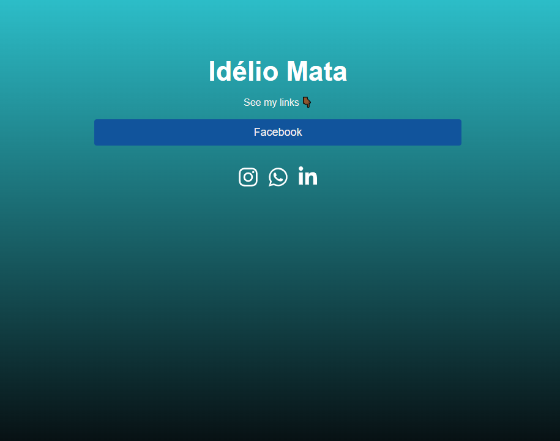

# My_Share_Link
**Welcome to My_Share_Link.**

Aqui você poderá encontrar e ver todos os meus trabalhos agrupados e acessíveis de forma fácil. 
Justamente para você que tem dificuldades ou inexperiência com GitHub, aqui é o lugar certo para você!

Dê uma olhada e confira todos os projetos incríveis que já trabalhei. Não perca a oportunidade de ver meu trabalho e ficar impressionado com minhas habilidades. e
quem sabe, talvez eu seja o candidato perfeito para sua empresa."
 

>[Clique aqui para ver site](https://mylinkshare.netlify.app/)

 

 ## Login page

Essa é a tela inicial da app.

  Email e Senha são necessários para acessar o Dashboard e poder  adicionar os seus Links.  
  
  Essa tela, só é acessivel para mi.   A tela que tu verás, será apenas de visualização dos links que já previamente partilho.
   - Para aceder a essa tela, adicione __/login__ na url.

    

## Dashboard

Lugar reservado ao cadastro de Links, personalização e pré-visualização.

  

## Links no Dashboard

Depois de adicionar os Links desejados no Dashboard ele será visualizado e poderá ser eliminado..

  

## Àrea de redes sociais

Nesta sessão pode-se adicionar até Links das suas redes sociais...  Tenha em conta que essa área só é vista pelo administrador, portanto depois de adicionados os links das dredes sociais, sempre que acessar essa pagina, os campos dos links das redes sociais estarão automaticamente preenchidos, possibilitando somente a sua edição. 

  

## Visão do utilizador

Nesta sessão pode-se adicionar até Links das suas redes sociais...  Tenha em  

  

##  Technology
  - React Js
  - HTML
  - CSS
  - Git e Github
  - Firebase

## Contacto
<idelioteofilomata@gmail.com>

[linkedin](https://www.linkedin.com/in/id%C3%A9liote%C3%B3filomata/)
